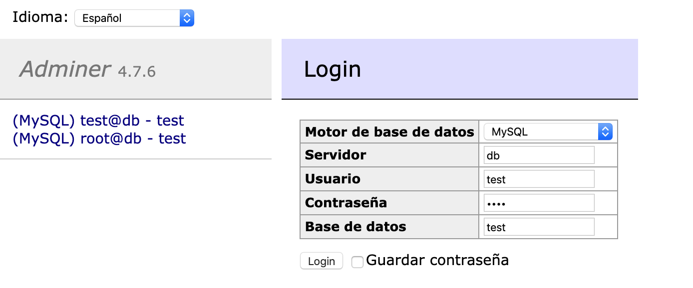
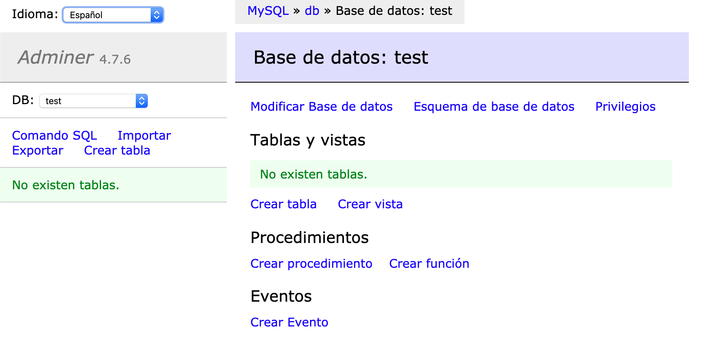
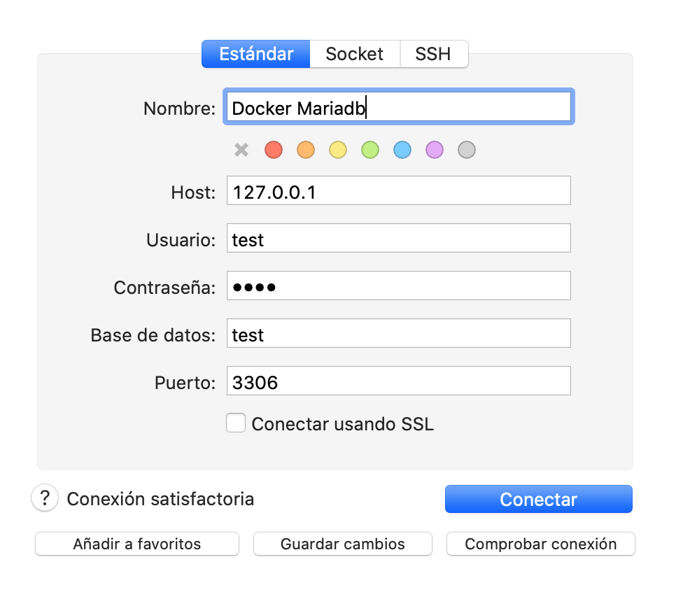

# Docker Mariadb Adminer

Para ejecutar solo hay que correr el siguiente comando:

`docker-compose up -d`

Este comando genera los contenedores requeridos:

* Mariadb
* Adminer

## Acceder al administrador Adminer
Para acceder al servidor por medio del navegador solo se requiere entrar con:

[http://localhost:8080/](http://localhost)

### Datos de acceso:

Los datos de acceso son: 
- Motor de base de datos: **MySQL**
- Servidor: **db**
- Usuario: **test**
- Contraseña: **test**
- Base de datos: **test**

Imagen cuando ya se acced:

***NOTA: Es posible que tarde en entra ya que primero debe estar el contenedor de mariadb.***

## Acceder con cliente de base de datos:

En este caso vamos a probar con **SequelPro**:

Los datos de acceso son:
* Host: **127.0.0.1**
* Usuario: **test**
* Contraseña: **test**
* Base de datos: **test**
* Puerto: **3306**

